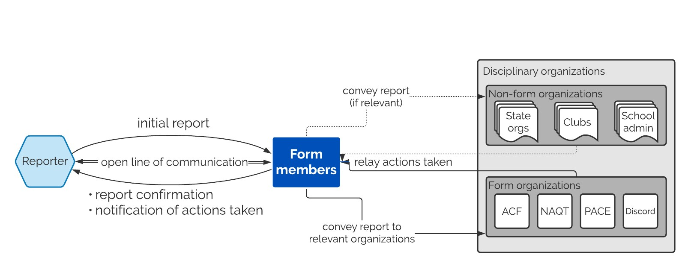

The following diagram displays the flow of information after a misconduct report is made.

<h2>Organizations</h2>
After a report is submitted, the form representatives will work with the reporter to determine which organizations should be contacted about the report. There are two main types of organizations: form organizations and non-form organizations. There is also the option of publicizing reports where the content of the report is of broad community interest and the reporter wishes for the report to be public.

<h3>Form organizations</h3>
These are the four organizations on the Misconduct Reporting Form: ACF, NAQT, PACE, and the Discord. While representatives from each of these organizations are privy to every report, the rest of the organization (including the organization's executive board and disciplinary committee members) are not informed of a report unless the decision is made to convey the report to them. Each of these organizations has a separate disciplinary process and misconduct sanctioning decisions they make are wholly independent of form operation.

<h3>Non-form organizations</h3>
These are organizations that the Misconduct Reporting Form might inform about a report if it seems important to notify them; for instance, if the report is about someone who frequently staffs University of Michigan tournaments, it's likely that the form would contact the Michigan club to let them know about the report. Non-form organizations also encompasses non-quizbowl organizations, like a school administration.

<h3>Public reports</h3>
In rare situtations, a report is of enough community-wide interest that the misconduct form representatives will ask the reporter about making the report public. If the reporter assents, the misconduct form representatives will publicize the report.